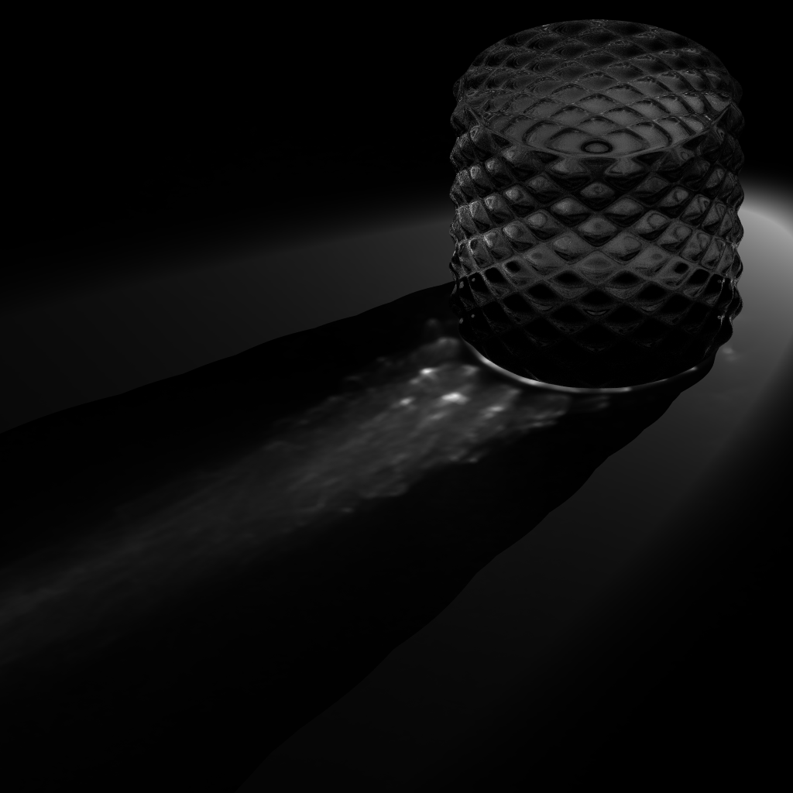

# Trace.jl
[![][docs-dev-img]][docs-dev-url]

Physically-based ray tracing on CPU / ?

[docs-dev-img]: https://img.shields.io/badge/docs-dev-blue.svg
[docs-dev-url]: https://pxl-th.github.io/Trace.jl/dev/


Output from `/scenes/shadows.jl`.

## Install

```
] add https://github.com/pxl-th/Trace.jl.git
```

## Examples

All of the examples are available in `scenes/` directory.

Example of running caustic glass scene (note that it supports multithreading).

```bash
julia -t 4 --project=. scenes/caustic_glass.jl
```

### Caustic simulation

Caustic effect using Stochastic Progressive Photon Mapping on a glass block.

|Image|Video|
|:-:|:-:|
|||
|100 iterations, ray depth 8|25 iterations per frame, ray depth 5. [YouTube](https://www.youtube.com/watch?v=87NlMA3Vwvs)|
